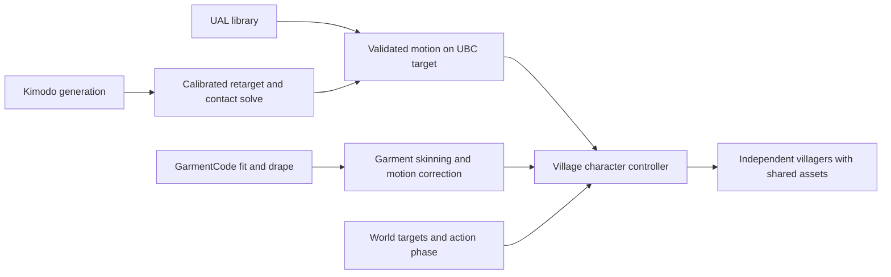

# Villager animation diagnosis — September 7, 2026

Both identified workflows are useful ingredients for the village. The common missing layer is a consistent character contract with contact-aware motion and garment deformation that remains valid throughout actions. Motion generation, skeletal transfer, static garment draping, secondary bone dynamics, and village action control each solve different parts of that problem.

This is a diagnosis and proposed implementation sequence. No character builder, asset, viewer, or village runtime was changed. Existing diagnostic numbers below are attributed to their reports; browser observations and the isolated Three.js seek reproduction were checked during this review.

**Today's work and current baseline.** Claude project history confirms the Kimodo four-motion comparison, beam lift/set-down, and subsequent crossed-arm correction on September 7 PDT. The latest lift export is `art/quaternius-stationary-trial/assets/mannequin-kimodo-lift.glb`, modified 17:21. The later clothing baseline is GarmentCode B5; male GLB modified 18:17, report modified 18:24. Relevant Claude sessions end in `72d50922-6774-4d8f-95e7-dc60a881e7e5` (Kimodo) and `7ba0891a-7359-44e7-a263-154f7fb4b0eb` (UBC/clothing).

| Workflow | What is reusable | What remains unresolved |
|---|---|---|
| Kimodo SMPL-X → Quaternius mannequin | Valid conversion, several recognizable motions, corrected lift hand sides, authored beam trajectory/export | Target proportions, individual foot plants, palm/finger contact, motion quality for complex prompts |
| UBC + UAL → GarmentCode B5 | Two base bodies, 43 clips, physically draped outfit shape, improved textures, corrected garment bind space | Long-skirt stride/sit deformation, collision proxies, reliable spring evaluation |
| Existing village renderer | Skeleton-aware cloning, per-character mixer, pose-to-clip mapping, phase variation, tick-driven playback | Adoption of these new assets and their constraints, task/prop integration, movement-speed matching, crowd budgets |

**1. Motion transfer currently loses contact information.**

`art/quaternius-stationary-trial/scripts/kimodo_to_track.py:58` reads Kimodo `foot_contacts`, but only retains a summary fraction; per-frame contact labels are not written into the converted motion track. `scripts/build_mannequin_motion.py:347` measures foot heights and applies a global root/floor correction. This preserves approximate floor height without locking each foot horizontally through a stance interval. The hand correction at line 377 rotates the shoulder to raise a low hand; it is not a general arm IK/contact solve.

The current retargeter uses a clip's initial outgoing joint directions and changes in global rotations (`art/quaternius-video-motion-trial/scripts/build_quaternius_video.py:74`). That can produce recognizable motion while leaving roll, proportion, and contact problems. Reported 80–99° alignment values are calibration rotation magnitudes, not residual errors; they cannot by themselves prove a bad retarget.

The crossed arms in the earlier lift were caused by swapped left/right hand targets and are already corrected in r04 (`art/quaternius-stationary-trial/REVIEW.md:132`). The current beam follows the mannequin's palms; finger closure is a fixed rule. The 3.9-second exported pose visibly lifts the beam off the trestles, but does not establish anatomically accurate grasping or physical load sharing.

Preserve contact intervals in the motion intermediate format, calibrate the source-to-target rest frames independently of an arbitrary action's first pose, then solve feet, pelvis, hands, and prop targets on the final character. Bake the resulting deformation-bone animation for repeatable actions. Use runtime IK only where terrain, target position, or body proportions require adjustment. A one-vector alignment alone does not determine twist about that vector.

Kimodo is a kinematic generator. Its official documentation says post-processing improves foot skating and constraint accuracy, and recommends sparse end-effector constraints. The lift's dense hand constraints merit a controlled sparse/dense comparison, but are not an established cause of the remaining defects. [NVIDIA Kimodo](https://github.com/nv-tlabs/kimodo), [generation limitations and guidance](https://research.nvidia.com/labs/sil/projects/kimodo/docs/key_concepts/limitations.html).

**2. The clothing's static drape has been converted into an insufficient deformation model.**

GarmentCode supplies sewing patterns and simulated draped geometry. That is a useful authoring foundation. The B5 game asset is a skinned mesh with an additional custom spring-bone pass; it does not carry the original cloth solver into Three.js. [GarmentCode implementation](https://github.com/maria-korosteleva/GarmentCode).

The A-pose garment/T-pose armature mismatch has already been addressed with inverse weighted skinning (`art/garmentcode/scripts/b5_build_garment.py:1428`). The saved round-trip test reports errors below 0.001 mm. This verifies that conversion for the tested pose; it does not verify arbitrary animated garment clearance. The earlier stray triangle was a Solidify offset issue, also fixed.

The remaining structural problem is specific:

- Skirt weights divide the surface into thigh sectors, with pelvis influence tapering down the garment (`b5_build_garment.py:1264`). Opposing leg motion drives a continuous skirt toward incompatible positions.
- Only the lower 40% is blended onto six skirt spring chains (`:1698`). Chains are pelvis-parented, use fixed hip offsets, and span 55% of skirt height (`:1631`). The current male chain tips stop approximately 15 cm above the hem.
- Collision pushes spring particles, not the intervening garment triangles. It does not enforce cloth stretch, bending, surface/body clearance, or self-collision across the entire skirt.
- `art/universal-base-characters/viewer/springBones.js:67` builds capsules toward `bone.children[0]`. Both B5 GLBs put `skirt_b_01` first under the pelvis, so this collider points into a skirt chain instead of the intended structural body segment. Collider endpoints must be explicit.

Live B5 walk in Chrome shows large thigh openings with springs both enabled and disabled. The seated clip leaves exposed thighs and cloth trailing behind the calves. A missing chair is a separate scene-contact issue; this screenshot cannot establish that the underlying seated body animation is defective.

The existing B5 report records male walk/jog penetration depths of 105/127 mm into a closed 1.6 cm voxel body proxy. These support the large visible failure, but are not exact original-skin distances. The report's “skin inside garment” count actually measures face-centroid proximity to clothing, not visibility or an inside test. Do not optimize against that label as if it proved exposed skin.

For the current long skirt, first validate garment-specific weights and a control/collision layout that covers the actual hem and thighs. A handful of corrected springs may improve it, but cannot guarantee full surface containment. For a limited action library, authored or simulated pose/clip correctives are a practical option; validate their transitions. For unrestricted near-camera motion, evaluate a low-resolution cloth proxy with surface constraints and body collisions, then transfer its deformation to the render mesh. Use simpler skinning/correctives and reduced secondary simulation at distance. Skin culling can hide permanently covered body areas; it cannot repair the skirt silhouette.

**3. The review viewer can produce misleading pose and spring evidence.**

`viewer/viewer.js:135` calls `mixer.setTime()` while the action is paused. The installed Three.js was tested with a one-second position clip: requesting 0.4 seconds while paused left `action.time=0` and position 0; unpaused produced time and position 0.4. The slider also pauses before calling this path (`:225`).

The spring warm-up advances spring particles while the body remains at frame zero, then jumps to the requested time. The capture script also seeks without simulating the complete preceding motion (`art/garmentcode/scripts/b5_capture.mjs:70`). Consequently, the old “springs on/off look identical” strips do not establish steady-state equivalence. The live garment failure is independently visible.

Repair the review path first: evaluate the requested animation pose deliberately, reset secondary state after applying the starting pose, and advance animation plus springs together at a fixed step to the target time. Record actual action time, asset identity, and simulation history. Compare continuous playback and reconstructed seeks at the same pose. Never use a lower FPS or clamped elapsed time as evidence that motion is correct.

**4. Converge the experiments on one production body family.**

UBC is the strongest current candidate: downloaded bodies already support the UAL library, and B5 garments are built around them. The local UBC review nevertheless records different limb lengths and rest orientations, so matching bone names is only a compatibility starting point. [Quaternius UBC](https://quaternius.com/packs/universalbasecharacters.html).

Keep one stable base skeleton definition: hierarchy, rest transforms, units, forward/up axes, root-motion ownership, bind matrices, and prop sockets. Fit and skin each body/outfit variant against that definition; allow per-body retarget/contact calibration where proportions differ. Secondary garment bones should extend that base predictably. Transfer Kimodo directly to this production target instead of repeatedly transferring through intermediate characters.

The current village still loads `meadow-civilian.glb` and `meadow-civilian-apron.glb` (`src/wild/scene/villagerAssets.ts:80`). Its `SkeletonUtils.clone` path at line 170 and `src/wild/scene/animator.ts` already provide useful crowd foundations. Neither animation trial is integrated merely because its separate viewer works.

**Proposed implementation sequence and acceptance gates.**

1. **Reliable inspection.** Own `viewer.js`, `springBones.js`, and the B5 capture harness. Correct seeking, warm-up and explicit collider endpoints. Pass: distinct requested times show distinct correct poses; a replayed fixed-step state agrees with continuous playback; both body variants have correctly placed colliders.
2. **One unclothed target, five actions.** Establish the UBC rig contract and idle, walk, turn, sit, and pickup. Start with existing UAL clips, then validate one Kimodo clip on exactly the same target. Pass: planted soles hold through stance, limb lengths stay fixed, final GLB agrees with Blender, and one-shots end/replay correctly. Measure tolerances in character-scale units and inspect surfaces as well as joints.
3. **One outfit through every action.** Preserve the intended outfit silhouette while fixing deformation. Test rest, opposing strides, wide step, seated pose, and pickup reach. Pass: no visible thigh windows, major penetrations, explosions, or abrupt corrective transitions at the intended gameplay camera and close inspection. Inspect the current long skirt explicitly; a short-wrap comparison does not validate it.
4. **Two villagers complete real village work.** Walk to a target, pick up a real prop, carry it, place it, release it, and resume movement. Let the village own in-place locomotion translation and tie clip speed to actual travel speed. Define action phases and prop-local grips. During a two-person carry, use one prop trajectory and separate reach/contact constraints for each actor. Pass: independent animation state, continuous support/contact through pickup and release, no double root motion or synchronized duplicates. Keep visual constraints in the renderer; preserve the pure deterministic simulation core.
5. **Scale the proven path.** Test 10, then 30, then the intended population on target hardware. Reuse loaded geometry, materials, textures and clips; give each villager its own skeleton/mixer/secondary state. Budget triangles, draw calls, shadows, animation updates and cloth separately; add distance-based detail and simulation rates from measurement. Pass: real mixed actions, acceptable frame time, working pause/scrub/replay, and no state sharing between villagers. No crowd performance claim was established by this review.

The next bounded milestone should be one UBC villager and one outfit completing the five-action test, followed by two villagers completing one actual village task. That validates the reusable pipeline before multiplying characters, costumes or generated clips.

**Reviewed asset identities (SHA-256).**

| File | Hash |
|---|---|
| `mannequin-kimodo-lift.glb` | `F00E2EA500F1BA33052E7C3E58E072BBB308C555D63A5C4C5D44E8C9D4088188` |
| `ubc-male-B5.glb` | `0503366A98EA1A340F93355555E669B15CBA86496117535C26D1246DBCB09603` |
| `ubc-female-B5.glb` | `527C5F1A96B778FFEEB01F9EB15A3F276B629D7A7138D7EEF58FDD7374D262E6` |

Browser review: `http://127.0.0.1:5220/?study=gc-b5&body=male&clip=Walk_Loop&camera=side`; live walk and seated selection also inspected in Chrome after the in-app clothing preview did not reliably advance. Kimodo contact pose inspected in the in-app browser at `http://127.0.0.1:5218/?study=kimodo_lift&clip=LiftSetDown&time=3.900`, Hands camera. No builders or full application test suite were run; this task changed only this report.
